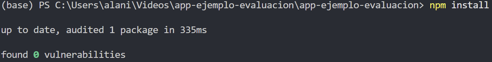
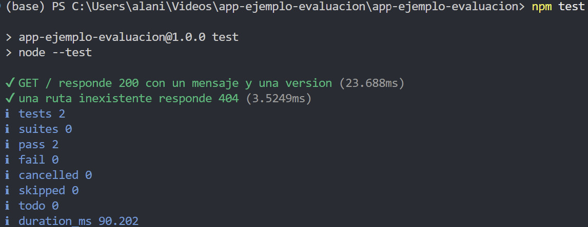
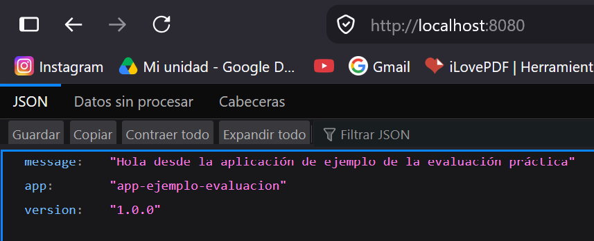
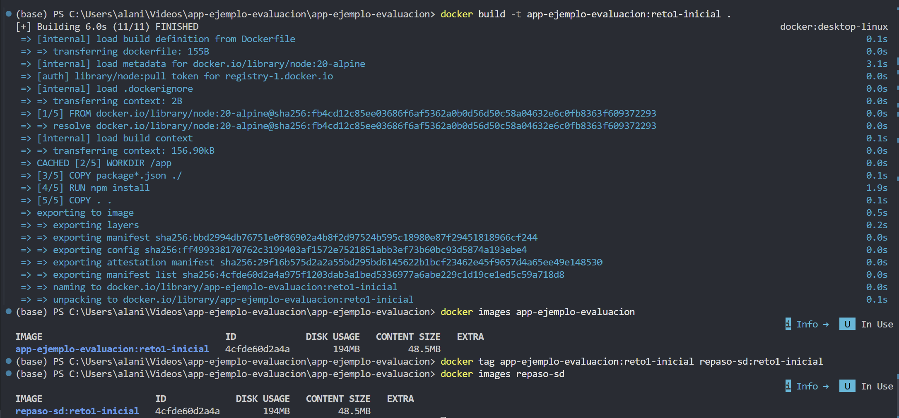
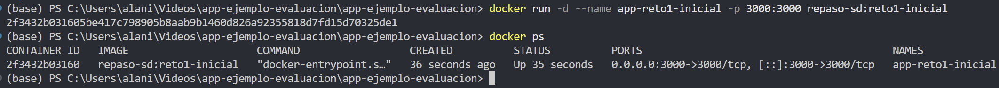
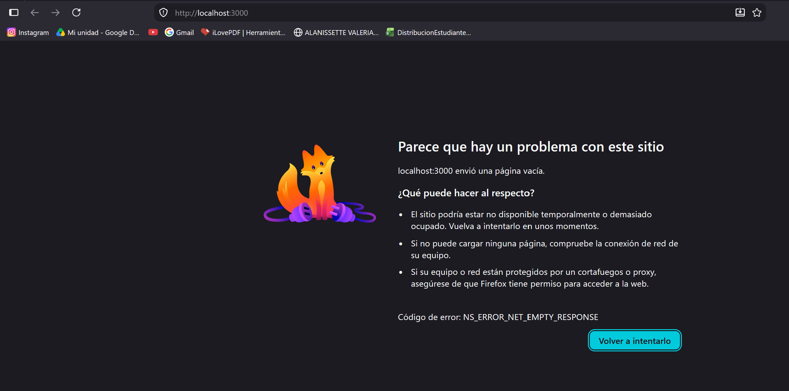
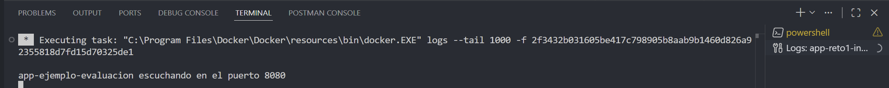
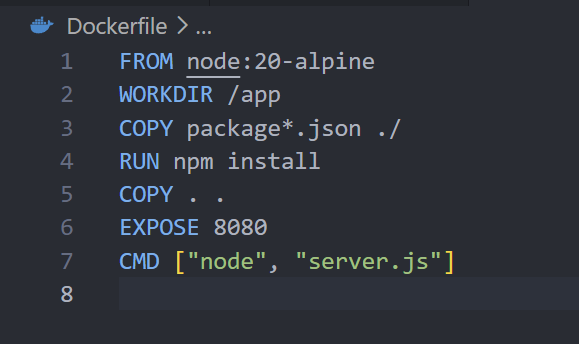
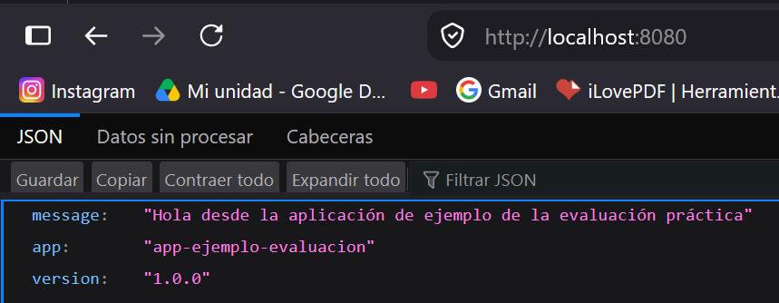

# Aplicación de ejemplo — Evaluación práctica (Docker, Kubernetes y CI/CD)

Aplicación mínima y neutral, provista únicamente para esta evaluación. No pertenece a ningún proyecto previo del curso: todos los estudiantes parten exactamente del mismo punto.

## Qué hace

Un servidor HTTP simple, sin dependencias externas, que expone:

- `GET /` — responde `200` con un mensaje, el nombre y la versión de la aplicación, en JSON.
- `GET /health` — responde igual que `/`, útil como endpoint de verificación de salud.
- Cualquier otra ruta — responde `404`.

Escucha por defecto en el puerto **8080** (configurable con la variable de entorno `PORT`).

## Cómo ejecutarla localmente

```
node server.js
curl http://localhost:8080/
```

## Cómo correr las pruebas

```
npm test
```

Usa el ejecutor de pruebas integrado de Node.js (`node --test`), por lo que no requiere instalar dependencias adicionales.

## Uso en la evaluación

Esta aplicación es el punto de partida para los tres retos de la evaluación práctica. Los archivos de Docker, Kubernetes y del pipeline de CI/CD **no se incluyen aquí a propósito**: se describen en el enunciado de la evaluación, con el defecto correspondiente, para que usted los recree y los corrija.

## Evidencia inicial obligatoria
•	Captura o registro de la instalación de dependencias.
```powershell
npm install
```

•	Captura o registro de la ejecución exitosa de las pruebas iniciales.
```powershell
npm test
```

•	Captura o registro de la aplicación respondiendo localmente.
```powershell
npm start
```

## Evidencias Reto 1
•	Captura o registro de la construcción de la imagen.
```powershell
docker build -t nombre-imagen:etiqueta .
```

•	Captura o registro del contenedor en ejecución.
```powershell
docker run -d --name nombre-contenedor -p puerto-anfitrion:puerto-contenedor nombre-imagen:etiqueta
docker run -d --name app-reto1-inicial -p 3000:3000 repaso-sd:reto1-inicial
```

•	Captura o registro del intento fallido de acceso inicial.

•	Captura o registro que permita identificar el problema.

•	Captura o registro del archivo corregido.

•	Captura o registro de la aplicación respondiendo correctamente desde la máquina anfitriona.
```powershell
docker build -t nombre-imagen:etiqueta .
# Reconstruir Imagen
docker build -t repaso-sd:reto1-corregido .
# Detener contenedor falloso
docker stop app-reto1-inicial
# Ejecutar Contenedor Corregido
docker run -d --name app-reto1-corregido -p 8080:8080 repaso-sd:reto1-corregido
```

## Evidencias Reto 2
•	Captura o registro de la aplicación del manifiesto inicial.

•	Captura o registro de los pods en estado Running.

•	Captura o registro del Service sin endpoints o sin destinos válidos.

•	Captura o registro del manifiesto corregido.

•	Captura o registro del Service con endpoints poblados.

•	Captura o registro de una petición exitosa hacia la aplicación usando el servicio de Kubernetes.
```powershell

```